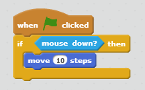

# scratching

### scratching allows you to write Scratch programs in Processing.

written by Buck Bailey and Eli Baum, 2014


By now, you are probably an expert in Scratch. But most programming languages are not like Scratch. Instead of dragging in blocks, you type commands.

So instead of



you would write something like

```
function whenGreenFlagClicked() {
    if (mouseDown == true) {
        move(10)
    }
}
```

Just like there are many spoken languages (English, Spanish, Chinese) there are also many programming languages. You have been working in **Scratch**. You may have heard of others. Now, you will learn **Processing**, which is based on **Java**.

We have written some code (called "**scratching**") which will allow to you write Processing programs from your old Scratch programs. All you need to do is copy scratching into a new tab in Processing.

Below are some instructions on how to use Processing, as well as a full reference for all of the scratching commands.

---

##### Let's take a look at a basic sketch:

Explanation of all code is below.

```
Sprite cat;

void setup() {
	size(600, 600);
	cat = new Sprite(this);
}

void draw() {
	background(0);
	
	cat.move(2);
	cat.draw();
}
```

If you run it, you should see the cat moving to the right across the screen.

So how does it work?

`Sprite cat;` This makes a sprite called "cat". **Notice the semicolon ; at the end of the line. You need one after every command!**

`void setup() {` The setup function runs once, at the beginning of your program. This is its *function definition*. A function is like a script in Scratch. It must have a name ("setup"), followed by parantheses. The curly bracket starts the function. Inside of functions, we usually *indent* code (use the tab key).

*What does "void" mean?* I'll tell you later.

`size(600,600);` The size *function* tells the computer how big you want your window to be. Here, it is 600 pixels by 600 pixels. Notice the semicolon at the end of the line!

`cat = new Sprite(this);` This line actually *creates* the *new* sprite. Don't worry to much about it for now. Just don't forget it.

You know what else you shouldn't forget? ***Semicolons!***

*What does "this" mean?* Stop asking so many questions.

`}` This curly bracket closes the setup function.

Next, we have the `draw` function. The draw functions runs over and over again. So you can use to repeatedly draw to or update the window. Because of this, if you only want to draw something once (something that never needs to be updated), you can just put it in `setup`.

`background(0);` You'll probably always want this line at the beginning of your draw function. It clears the screnn: the argument is a color. 0 is black, 255 is white, everything in between is gray.

If you didn't clear the background, you would just keep seeing new images of the cat sprite on top of eachother.

`cat.move(2);` As you can probably guess, this command **moves** the **cat** sprite **2** pixels. Note that because the draw functions loops over and over again, the cat repeatedly moves 2 pixels — the result is that you see smooth motion on your screen.

`cat.draw();` This actually draws the cat to the screen.

---
## Full Command Reference
In no particular order.

#### Sprite Commands

`Sprite(PApplet parent)` Creates a new sprite in the specified `PApplet`. Will usually be `this`.

`void draw()` Draw the sprite.


*Costuming*

`void loadDefaultCostumes()` Loads the default cat costumes.

`void addCostume(String filePath)` Add the costume image at the specified path. Image types `.gif`, `.jpg`, `.tga`, `.png`.

`void nextCostume()` Switch to the next costume. Will wrap around to the first costume.

`void previousCostume()` Switch to the previous costume. Will wrap around to the last costume.

`void setCostume(int newCostumeNumber)` Switch to the specified costume. Be aware that the costume list is zero-index, so `setCostume(0)` will set the sprite to the first costume.


*Visual Effects*

`void show()` Show the sprite.

`void hide()` Hide the sprite. Note that this affects “touching” functions - a hidden sprite cannot be “seen” by Sprite, either!

`void setGhostEffect(int newAlpha)` Sets the ghost effect (transparency). 100 is fully transparent; 0 is fully opaque. A Sprite hidden by the Ghost Effect can still be detected by other Sprites.

`void setColorEffect(int newAlpha)` Sets the “color effect,” changing Sprite hues. Range is 0 to 100.

Color and Ghost effects can also be set via the properties Sprite.colorEffect and Sprite.ghostEffect.


*Dialog*

`void say(String what)` Draw a word bubble with “speech arrow”.

`void think(String what)` Draw a word bubble with “thought bubbles”.

Optionally, include a second argument to say/think for a number of seconds, for example, `Sprite.say("Hello!",2)`


*Moving and turning*

`void move(int distance)` Move the sprite some distance (in pixels). Note that this function accounts for the sprite's current angle.

`void turn(float angle)` Turn by specified angle, **degrees**.

`void turnLeft(float angle)` Turn left.

`void turnRight(float angle)` Turn right.

`void wrapAtEdges()` “Wraps” Sprite from left to right, bottom to top, etc, when it has moved off-stage.


`void pointTo(int x, int y)` Point To the coordinates (x, y).

`void pointInDirection(float angle)` Point in the specified direction, **degrees**.

`void pointToSprite(Sprite target)` Point to another sprite.

`void pointToMouse()` Points To the mouse pointer. This will only work if the mouse pointer is contained within the applet window.


`void goToXY(int x, int y)` Sets the sprite's position to (x, y).

`void goToSprite(Sprite target)` Set the sprite's position to that of another sprite.

`void changeXY(int x, int y)` Moves Sprite by x, y modifier.


`float directionToXY(float x, float y)` Returns the direction from Sprite to X, Y coordinates.

`float directionToSprite(Sprite target)` Returns a heading to point Sprite towards target Sprite.


`float distanceToXY(int x, int y)` Returns the distance to another point.

`float distanceToMouse()` Returns the distance to the mouse pointer.

`float distanceToSprite(Sprite target)` Returns the distance to another sprite.


*Translate Vector, Direction, and Distance values*

`PVector vectorForSpeed(float distance)` Returns a PVector containing .x and .y differences for a given move distance. Uses the Sprite’s .direction property.

`float directionForVector(float x, float y)` Returns the direction of a given .x and .y Vector.

`float speedForVector(float x, float y)` Returns the move() speed of a Sprite given x and y Vector values.


*Detecting other Sprites*

`boolean touchingSprite(Sprite target)` Returns true if the sprite is within the rectangular bounding box of another sprite.

`boolean touchingRoundSprite(Sprite target)` Returns true if the sprite is within a circular bounding box of another sprite. Uses width and assumes Sprite is actually round.

`boolean facingSprite(Sprite target)` Returns true if Sprite is currently pointed towards Target. Uses 180 degree sight range.

`boolean seesSpriteOnRight(Sprite target)` Returns true if target is to the right of the Sprite’s current direction.

`boolean seesSpriteOnLeft(Sprite target)` Returns true if target is to the left of the Sprite’s current direction.

`boolean withinSightRange(Sprite target, float range)` Similar to “facingSprite” but allows you to specify the visual range. Use a range of 1 to see if Sprite is pointed directly at target.

Remember that *hidden* Sprites cannot be detected. But “Ghost Effected” Sprite can.


*Detecting Stage boundaries*

`boolean touchingTopEdge()`
`boolean touchingBottomEdge()`
`boolean touchingLeftEdge()`
`boolean touchingRightEdge()` 
`boolean touchingEdge()` Detect whether the Sprite is touching an edge of the screen.

`boolean isOffStageTop()`
`boolean isOffStageBottom()`
`boolean isOffStageLeft()`
`boolean isOffStageRight()`
`boolean isOffStage()` Returns true if Sprite has moved off stage. You can specify which edge.

*Pen actions*

`void drawOnStage(Stage stageToDrawOn)` Use in setup() to attach Sprite’s “pen” commands to a Stage object.

`void drawOwnCanvas()` Tells Sprite to draw its own pen canvas. This is the default, but it can introduce a lot of lag.

`void penDown()` Sets the pen “down” on the canvas – begins drawing, in other words. When the Sprite is moved with functions like move() and goToXY(), it will draw a line behind it.

`void penColor(int r, g, b)` Set pen color to specified RGB values.

`void penWidth(int width)` Sets line width of the pen.

`void penClear()` Erase the pen canvas.


#### Stage Commands
You can use a stage if you don't want just a boring solid-color static background.

`Stage(PApplet parent)` Creates a stage in the specified applet. Will probably be `this`.

`void draw()` Draw the stage.

`void drawTiled()` Fills the stage by repeating the backdrop in tiles.

`void scrollBackdrop(float x, y)` Scrolls the backdrop by x, y values. The backdrop will repeat.

Scrolling is currently in development - it works but not efficiently.


*Setting the Backdrop*

`void loadDefaultBackdrop()` Load the default backdrop(s) into the backdrop list.

`void addBackdrop(String filePath)` Add the backdrop image specified by the path.

`void nextBackdrop()` Switch to the next backdrop.

`void previousBackdrop()` Switch to the previous backdrop.

`void setBackdrop(int newBackdropNumber)` Switch to the specified (zero-indexed) backdrop.


*Timer*


`void addTimer()` Adds additional timers. Timer 0 is created when the Stage is initialized.

`void resetTimer()` Sets timer 0 to 0.

`void resetTimer(int number)` Resets a specific timer.

`float timer()` Returns a decimal value for the default timer, 0.

`float timer(int timerNumber)` Returns time since timer X was initialized (or reset).


*”Ask” functionality to read a String of user input*

`void ask(String newQuestion)` Ask a question.

`String answer()` Returns the answer to the asked question.

`void questionKeycheck()` This *must* run inside of a keypress event (void keyPressed) if you are expecting responses.


*Motion trails (experimental)*

Introduces lag. Degrades background image quality.

void addTrail();

void removeTrail();

void setTrails(int number);

Change Stage.fadeColor from 0 to 255 for black to white.

## Exporting Applications

One of the great things about Processing is sharing your project with friends and family. But Processing does not include art files (such as .png) when it compiles an application! Don't worry, we have a fix. 

### Exporting for Windows

Unfortunately, exporting for Windows does not work at this time.

### Exporting for Linux

Exporting for Linux is untested, but "should" be the much the same as Mac OS. If you adapt fix_export.command for Linux, please send us an update!

### Exporting Application for Mac

In your code, in EVERY tab, replace ALL “images/“ with “program_name.app/”

In your void setup(), add: `if (frame!=null) frame.setTitle(“Program Name”);` Or you can put this in your draw() to change the title during gameplay.

Select Export Application from the File menu.
Select Mac OSX and Embed Java. Full Screen is your choice.

Double-click `fix\_export.command` to embed your `images` folder into the application.
This will also copy your images folder to appname.app, allowing you to continue testing in the PDE. From now on you will have to run fix_export.command every time you add new art to your images/ folder.

#### To change the app icon:
Right click and “Show Contents” of the application created inside application.macosx/ folder
You can replace Contents/Resources/sketch.icns with your own .ICNS file.
Use the web site http://iconverticons.com/online/ to create an .ICNS file from one of your game images. 

You may not see the new icon until you restart your computer or copy the application to a new folder. Don’t worry, it’s there.

You can move the file around but you CANNOT rename the application. It will stop working.
